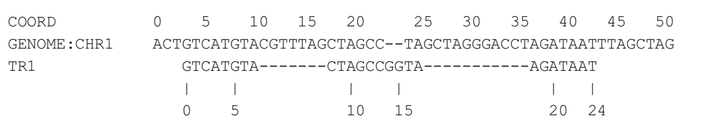

Problem
=======

Objective
---------
The objective is to write software that translates transcript coordinates to genomic coordinates. For example, consider the simple transcript TR1, which aligns to the genome as follows:

We can compactly express this alignment in the same way that we compactly represent a read alignment in the ​SAM/BAM format​: using a position and CIGAR string. In this case, the (0-based) position is CHR1:3, and the CIGAR string is ​8M7D6M2I2M11D7M​. For this exercise, you may assume that the transcript is always mapped from genomic 5’ to 3’.
The objective is then to translate a (0-based) transcript coordinate to a (0 based) genome coordinate. For example the fifth base in TR1 (i.e. TR1:4) maps to genome coordinate CHR1:7. Similarly, TR1:13 maps to CHR1:23 and TR1:14 maps to an insertion immediately before CHR1:24.

Problem Specification
----------------------

The software should be implemented in a language of your choice (with some preference towards python), and should conform to community-preferred style guidelines (e.g., python should be “pythonic” and conform to PEP-8). Code will be evaluated both on correctness and overall quality. Your solution should take the following inputs:
1. A four column (tab-separated) file containing the transcripts. The first column is the transcript name, and the remaining three columns indicate it’s genomic mapping: chromosome name, 0-based starting position on the chromosome, and CIGAR string indicating the mapping.
2. A two column (tab-separated) file indicating a set of queries. The first column is a transcript name, and the second column is a 0-based transcript coordinate.

Your solution should handle errors appropriately. The output is a four column tab separated file with one row for each of the input queries. The first two columns are exactly the two columns from the second input file, and the remaining two columns are the chromosome name and chromosome coordinate, respectively. Example input/output is provided below.
Third-party libraries can be used as much as desired except for solving the primary bioinformatics problem of translating coordinates. Correctness is naturally the most important feature of any solution. Following that, the implementation should demonstrate good software engineering practices with an eye towards efficiency and generality.

Sample Input/Output
-------------------
Input file 1:

> TR1 CHR1 3 8M7D6M2I2M11D7M
  TR2 CHR2 10 20M

Input file 2:

> TR1 4
  TR2 0
  TR1 13
  TR2 10

Output file:

> TR1	4	CHR1	7
  TR2	0	CHR2	10
  TR1	13	CHR1	23
  TR2	10	CHR2	20
